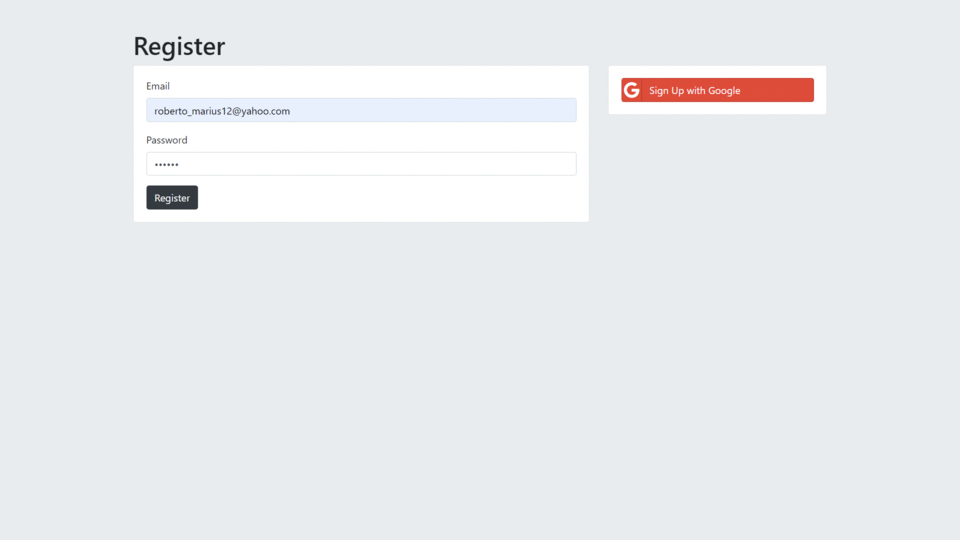

<svg fill="none"  width="80vw" height="4000" xmlns="http://www.w3.org/2000/svg">

<foreignObject width="100%" height="100%">
  

  

<h2 class="pro">Hi there , </h2>

  

    

      <h3>I’m Marius from Romania and I like to codin and I also like web design. I'm an tehnologi enthusiasm . I really enjoy learning languages and framworks like React and Tensorflow. Also enjoy wireframing, ui, ux and design in general.</h3>
    

    

      
    

  

<h2 class="pro">Languages and Tools</h2>

  

  

  

  

  

  

  

  

  

  

  

  

  

  

  

  

<h2 class="pro">Projects</h2>
  
  

    

            
            <button class="title" onclick="window.open('https://catrunamarius.github.io/Nexter/', '_top') ">Nexter</button>
            <button class="github" onclick="window.open('https://github.com/CatrunaMarius/Nexter')">View code</button>
            

             
             
            

         

         

            
            <button class="title" onclick="window.open('https://catrunamarius.github.io/Natours/', '_top') ">Natours</button>
            <button class="github" onclick="window.open('https://github.com/CatrunaMarius/Natours')">View code</button>
            

              
              
            

        

        

            
              <button class="title" onclick="window.open('https://catrunamarius.github.io/Trillo/', '_top') ">Trillo</button>
              <button class="github" onclick="window.open('https://github.com/CatrunaMarius/Trillo')">View code</button>
            

               
                 
             

        

         

            
              <button class="title" onclick="window.open('https://catrunamarius.github.io/e-Shopping/', '_top') ">e-Shopping</button>
              <button class="github" onclick="window.open('https://github.com/CatrunaMarius/e-Shopping')">[View code]</button>
            

              
              
              
            

        

    

    <button id="button" class="btn btn--green">Read more</button>
    

      

          
            <button class="title" onclick="window.open('https://secretsnodejs.herokuapp.com/', '_top') ">Secrets</button>
            <button class="github" onclick="window.open('https://github.com/CatrunaMarius/Secrets')">View code</button>
        

           
           
          

     

      

        
          <button class="title" onclick="window.open('https://catrunamarius.github.io/TinDog/', '_top') ">TinDog</button>
          <button class="github" onclick="window.open('https://github.com/CatrunaMarius/TinDog')">View code</button>
       

         
         
        

     

  

  

  <h2 class="pro">Contac Me</h2>
  

    
    
    
  

</foreignObject>
</svg>

<!-- </svg>   -->
