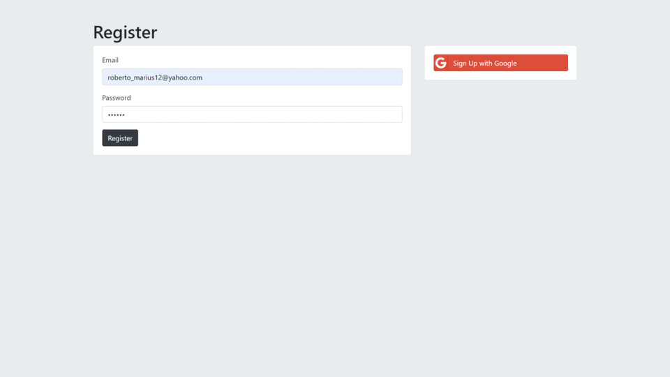
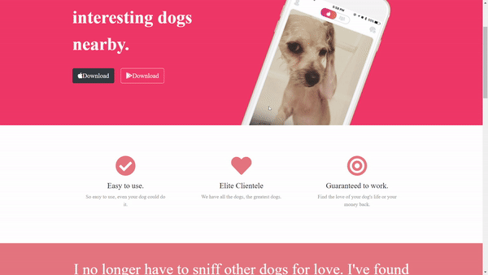

<foreignObject width="100%" height="100%">

<h2 class="pro">Hi there , </h2>

  
  

    

      <h3>I’m Marius from Romania I'm an tehnologi enthusiasm  I like to coding and website design . I really enjoy learning languages and framworks like React and Angular. Also enjoy wireframing, ui, ux and design in general.</h3>
    <!-- 

    
 -->
      
    

  

 
 

<h2 class="pro">Languages and Tools</h2>

  
  
  
  
  
  
  
  

 
 
 
 

<h2 class="pro">Projects</h2>
      

            
            
            
            
            

              
 More projects 

               
            
            
            

      
   
  <h2 class="pro">Contac Me</h2>
  

    
    
    
  

 

</foreignObject>
